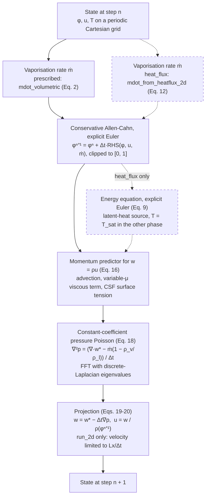
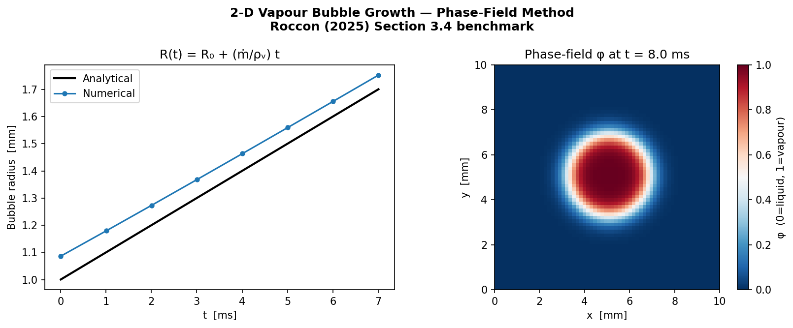
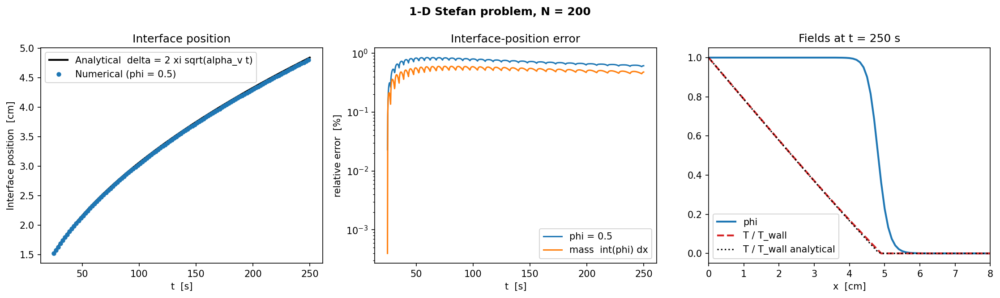

# boiling-phasefield-3d

Python prototype of a phase-field solver for boiling heat transfer, extending
the validated 1D/2D method of **Roccon (2025)** toward full 3D DNS.

> Roccon A. (2025). *Boiling heat transfer by phase-field method.*
> Acta Mechanica 236, 5623–5638. https://doi.org/10.1007/s00707-024-04122-7

---

## System requirements

| Requirement | Notes |
|---|---|
| Python ≥ 3.10 | Tested on 3.12 (Anaconda) |
| NumPy, SciPy, Matplotlib | See `requirements.txt` |
| Mac / Linux | Works on Apple Silicon (M1/M2/M3), no CUDA needed |
| GPU / Fortran | **Not required** for this prototype |

The production HPC code will require NVIDIA GPU + Fortran + MPI (not available
on Apple Silicon). This prototype runs entirely in Python/NumPy.

---

## Physics

The solver couples four governing equations on a uniform Cartesian grid,
following Roccon (2025) Section 2:

| Equation | Paper ref | What it does |
|---|---|---|
| Conservative Allen-Cahn | Eq. 1 | Tracks the vapour-liquid interface via φ ∈ [0,1] without geometric reconstruction |
| Mass conservation | Eq. 3 | Accounts for density jump across the interface during vaporisation |
| Navier-Stokes (one-fluid) | Eq. 4 | Flow field; density and viscosity vary continuously with φ |
| Energy equation | Eq. 9 | Temperature field with latent-heat source term |

**Key numerical property:** the one-fluid NS formulation yields a
*constant-coefficient* Poisson equation for pressure (Eq. 18), which is solved
via FFT-based direct solvers. This property holds in 3D and makes the code
directly GPU-portable, which is the core motivation for choosing this method.

**Vaporisation rate:** computed in two ways (selectable via `SimParams.mode`):
- `'prescribed'`: surface rate ṁ is given directly (bubble growth benchmark)
- `'heat_flux'`: ṁ computed from Rankine-Hugoniot heat-flux balance (Eq. 12)
  at the interface. The library 2-D path (`run_2d`) is **not validated**; the 1-D
  Stefan problem uses the dedicated solver `src/stefan1d.py`, see below

One explicit time step of the library solver (`run_2d` in `src/solver.py`; `run_3d` follows the same
sequence in `prescribed` mode only). Dashed boxes mark the `heat_flux` pathway, which is not
validated (see "Validation status"):



---

## Project structure

```
boiling-phasefield-3d/
│
├── src/                        Core solver library
│   ├── params.py               SimParams dataclass, all physical and numerical
│   │                           parameters in one place with sensible defaults
│   │
│   ├── operators.py            2nd-order central-difference spatial operators
│   │                           (∂/∂x, ∂/∂y, ∂/∂z, ∇, ∇·, ∇²) for both 2-D
│   │                           and 3-D. Periodic BCs via np.roll.
│   │
│   ├── phase_field.py          Conservative Allen-Cahn RHS (Eq. 1) with
│   │                           vaporisation source. Provides ac_rhs_2d and
│   │                           ac_rhs_3d. Also mdot_volumetric() for the
│   │                           prescribed-rate mode (Eq. 2).
│   │
│   ├── pressure.py             FFT-based solver for the constant-coefficient
│   │                           Poisson equation ∇²p = rhs (Eq. 18). Uses
│   │                           discrete Laplacian eigenvalues. Provides
│   │                           solve_poisson_2d and solve_poisson_3d.
│   │
│   ├── flow.py                 Navier-Stokes projection-correction method
│   │                           (Eqs. 16-20). Mixture density/viscosity (Eqs.
│   │                           5-6). Surface tension via CSF model (Eq. 7).
│   │                           Provides ns_step_2d and ns_step_3d.
│   │
│   ├── energy.py               Energy equation RHS (Eq. 9) with latent-heat
│   │                           source Sₜ (Eq. 11). Simplified heat-flux
│   │                           vaporisation rate mdot_from_heatflux_2d.
│   │                           Mixture thermal diffusivity (Eq. 10).
│   │
│   ├── stefan1d.py             1-D Stefan problem: analytic reference (StefanReference)
│   │                           and a non-periodic solver (wall + outlet, compact
│   │                           energy stencil, probe vaporisation rate, |∇φ| mass
│   │                           source) with energy/mass budgets. Used by
│   │                           examples/stefan_1d.py and tests/test_stefan_1d.py.
│   │
│   ├── solver.py               Main time-integration loop. Couples Allen-Cahn,
│   │                           energy, and Navier-Stokes in the correct order
│   │                           (Roccon 2025 Section 2.5). Provides run_2d and
│   │                           run_3d. Accepts a callback for diagnostics.
│   │
│   └── diagnostics.py          Post-processing: bubble_radius_2d/3d,
│                               interface_position_1d, nusselt_number_2d,
│                               lp_norm, kinetic_energy_2d.
│
├── examples/
│   ├── bubble_2d.py            2-D vapour bubble growth at constant
│   │                           vaporisation rate. Validates R(t) = R₀ +
│   │                           (ṁ/ρᵥ)t against the analytical solution.
│   │                           Reproduces Roccon (2025) Section 3.4.
│   │
│   └── stefan_1d.py            1-D Stefan problem: superheated vapour drives
│                               vaporisation, compared against δ(t) = 2ξ√(αᵥt).
│                               Uses src/stefan1d.py; `--refine` runs the
│                               convergence study (see "Validation status").
│
├── requirements.txt            Python dependencies
└── README.md                   This file
```

---

## Validation status

Terms are used strictly: **implemented** (code exists), **verified** (a piece of the code is
checked against an exact identity, manufactured solution or another implementation),
**validated** (the coupled solver is compared with an analytic solution of the physical problem it
is meant to reproduce), **failed/unresolved**.

| Benchmark | Dimension | Status |
|---|---|---|
| Bubble growth at prescribed vaporisation rate | 2-D | Agrees with R(t) = R₀ + (ṁ/ρᵥ)t and the error **decreases systematically under grid refinement** (final-radius error 10.4, 2.8, 1.0 % at N = 32, 64, 128). The previously documented *second-order* rate is **not currently reproduced and is under re-evaluation**; no order is claimed (docs Section 11.1, "Re-evaluation"). The 2-D bubble path is unchanged by this work (bit-identical, protected by a golden-value test) |
| Stefan problem, matched densities, one superheated phase (St = 0.2) | 1-D, **dedicated solver** `src/stefan1d.py` | The dedicated 1-D Stefan solver reproduces the analytical benchmark with first-order spatial convergence, reaching 0.079 % interface-position error at Δx = 0.125 mm and t = 250 s (1.14, 0.61, 0.32, 0.16, 0.08 % for Δx = 2 → 0.125 mm). Mass and energy budget diagnostics verified. The analytic reference was itself verified independently. Matched densities only |
| **General multiphase heat-flux pathway** (`run_2d(mode='heat_flux')`, library `energy.py`) | 2-D | **Remains unvalidated / under validation.** `src/stefan1d.py` does not resolve its issues: an exploratory extruded-Stefan run through it still shows 5.7 % error at t = 28 s, 24 % at t = 40 s, and temperature undershoot to −0.97 K (two data points, short run) |
| Spherical bubble, prescribed vaporisation rate | 3-D | **3-D solver verified, not physically validated.** Verified: Poisson manufactured-solution convergence, projection convergence, phase-mass identity, and 2-D/3-D extruded consistency along all three axes (which found and fixed missing 3-D variable-viscosity terms). A sphere-volume consistency check (≈ 0.1 %) is flat in N and is **not** a convergence result. No physical 3-D boiling benchmark has been run |
| 3-D heat-flux mode | 3-D | Not implemented (`run_3d` raises `NotImplementedError`) |

This prototype is a development and verification environment, not a production solver.



*2-D bubble growth at a prescribed vaporisation rate (`examples/bubble_2d.py`, $N=64$). The
numerical radius starts above the analytical line because of the diffuse initial profile (+8.6 % at
$t=0$) and grows slightly more slowly than $\dot m/\rho_v$ (fitted slope 4.5 % low), so the offset
shrinks to +2.8 % at the final time. Values from the refinement table in the technical
documentation.*



*1-D Stefan problem with the dedicated solver `src/stefan1d.py` (`examples/stefan_1d.py`: 0.2 m
domain, $N=200$, $\Delta x=1$ mm). The $\phi=0.5$ interface error at $t=250$ s is about 0.6%, matching
the $\Delta x=1$ mm entry of the refinement sequence above. `--refine` runs $N=50$ to 400
($\Delta x=4$ to 0.5 mm) on the same domain.*

**Provenance of earlier Stefan numbers.** The 56 % (t = 250 s) quoted in earlier versions of this README, and in
material derived from it, is the *historical, pre-γ-fix* result (commit c125ad6). The unmodified pre-correction
HEAD (c9a2842) gives about 66.4 % with the same script. Neither is a result of the corrected dedicated solver, and
neither should be quoted as the current state; the current Stefan result is the dedicated-solver table in
`docs/Phase_Field_Boiling_Solver_Technical_Documentation.md` ("The Stefan problem").

The failure of the legacy scheme was the product of several interacting defects (a wide energy stencil with a
periodic wall wrap; a grid-point central-gradient vaporisation closure; the α_v·φ diffusivity; a probe assuming
T = T_sat at the front; and the φ(1−φ)/ε mass-source form). No single change cures it and none is claimed as the sole
root cause; the φ(1−φ)/ε source is the dominant *identified* source of the refinement-dependent failure. Quantitative
leave-one-out evidence is in the technical documentation, and the exploratory harness that produced it is in
`scripts/stefan_diagnosis/`.

An automated test suite (`tests/`) checks: the FFT Poisson solver against manufactured solutions (2-D and
3-D); exact mass conservation of the Allen-Cahn right-hand side; the 2-D bubble growth trend and golden
values; the Stefan reference solution (Stefan condition, exact energy budget, an independent moving-boundary
solve); the discrete energy/mass identities; the Stefan solver's convergence and budgets against the analytic
solution; 2-D/3-D consistency along all three axes; and a regression test that the *legacy* Stefan scheme
still fails (evidence for why it was replaced).

---

## Quick start

```bash
cd boiling-phasefield-3d
pip install -r requirements.txt

# Benchmark 1: 2-D bubble growth (runs in ~30 s on a laptop)
python examples/bubble_2d.py
# Output: bubble_2d_result.png (R(t) numerical vs analytical + final φ field)

# Benchmark 2: 1-D Stefan problem (~1 min on a laptop; add --refine for the ~2 min convergence study)
python examples/stefan_1d.py
# Output: stefan_1d_result.png (δ(t) numerical vs analytical, error vs time, final T and φ profiles)
```

### Running tests

```bash
pytest tests/ -v
```

Runs in one to two minutes. Expected result: 45 passed.

---

## Extending to 3-D

The `run_3d` function and all `*_3d` operator variants are already implemented.
The 3-D extension is the current focus of this prototype's development:

```python
from src import SimParams, run_3d
import numpy as np

p = SimParams(ndim=3, Nx=32, Ny=32, Nz=32,
              Lx=0.01, Ly=0.01, Lz=0.01,
              dt=5e-6, t_end=0.001,
              mode='prescribed', mdot_surf=0.1)

# Spherical bubble at domain centre
x = np.linspace(0, p.Lx, p.Nx, endpoint=False)
y = np.linspace(0, p.Ly, p.Ny, endpoint=False)
z = np.linspace(0, p.Lz, p.Nz, endpoint=False)
Z, Y, X = np.meshgrid(z, y, x, indexing='ij')   # shape (Nz, Ny, Nx), the layout the 3-D operators use
r    = np.sqrt((X - p.Lx/2)**2 + (Y - p.Ly/2)**2 + (Z - p.Lz/2)**2)
phi0 = 0.5 * (1 - np.tanh((r - 0.001) / (2 * p.eps)))

result = run_3d(p, phi0)
```

---

## Known limitations of this prototype

1. **Surface tension instability with large density ratios.**
   The explicit CSF model requires time step Δt ~ √(ρᵥ dx³/σ) ~ 10⁻⁹ s for
   water (ρᵥ/ρₗ = 0.001, σ = 0.07 N/m). This is impractical for explicit
   Euler. The bubble benchmark therefore uses σ = 0. An implicit surface tension
   treatment is needed to lift this restriction.

2. **The general multiphase heat-flux pathway is unvalidated.**
   The 1-D Stefan benchmark is reproduced only by the dedicated solver `src/stefan1d.py` (non-periodic
   wall/outlet, compact conservative energy stencil, probe vaporisation rate, |∇φ| mass source). None of
   these has been generalised to `run_2d` / `run_3d`, and the dedicated solver is not evidence that they work:
   the library `energy.py` still uses the nested central-difference operator, a grid-point closure and a
   latent-heat source `S_t` that does not match Roccon Eq. 11, and an extruded Stefan problem run through
   `run_2d(mode='heat_flux')` still fails (5.7 % at t = 28 s, 24 % at t = 40 s, with T undershoot to −0.97 K).

3. **Periodic boundary conditions only.**
   The pressure FFT solver assumes periodicity on all boundaries. Wall-bounded
   turbulence (the main PhD simulation) requires Dirichlet/Neumann BCs, which
   need a different solver (e.g., sine/cosine transform or tridiagonal solver).

4. **Explicit time stepping.**
   All equations use explicit Euler, which is first-order accurate in time.
   The paper uses the same scheme, but higher-order RK methods will be needed
   for turbulent DNS accuracy.

5. **Python performance.**
   NumPy is sufficient for 2-D prototype runs (64×64 in seconds). A 3-D
   turbulent simulation at 512³ requires Fortran + GPU: this prototype is
   a validation tool only, not a production solver.

6. **Fixed since initial development.** The Allen-Cahn mobility (`gamma`) dimensional scaling
   and the `mdot_from_heatflux_2d` sign/factoring bug were fixed and re-verified against the
   bubble-growth benchmark. The 3-D viscous term now includes the ∇μ·∇u terms the 2-D version already had
   (an implementation correction found by the extruded 2-D/3-D consistency test).
   **Identified, not changed:** in `heat_flux` mode the default `SimParams.gamma` inherits 0.1 m/s from
   `mdot_surf` (documented as used only in `prescribed` mode), ~300x the Stefan interface speed. A replacement
   default was tried and withdrawn because it is itself unvalidated; the proper fix (a run-time γ tied to the
   interface speed) belongs with the general heat-flux pathway. The dedicated solver does not use it.

7. **Stabilising safeguards in the library solver.** After each Allen-Cahn step `run_2d` and
   `run_3d` clip φ to [0, 1], and `run_2d` rescales the whole velocity field whenever
   max |u| exceeds `Lx / dt` (`src/solver.py`; the clamp is commented there as preventing
   blow-up of the explicit scheme). Both are numerical safeguards of this implementation, and the
   clip is not mass-conserving when it is active. The dedicated Stefan solver
   reports its clipped mass separately (zero in every refinement run, see the technical
   documentation).

8. **First-order accuracy, matched densities.** The Stefan solver converges at first order in Δx
   (staircase saturation clamp, explicit Euler), and has only been run with ρᵥ = ρₗ.

---

## Possible Extensions

Bringing the Stefan solver's ingredients (non-periodic boundaries, compact energy stencil, probe
closure, |∇φ| source) into the general 2-D/3-D path; a 3-D heat-flux mode and the physical 3-D
benchmark proposed in the technical documentation (spherical bubble in a superheated liquid);
density-ratio Stefan flow; wall-bounded (Dirichlet/Neumann) pressure solvers for turbulent-channel
DNS; parameter studies over Reynolds number, superheat, and density ratio; Nusselt-number scaling
laws using the existing `diagnostics.py::nusselt_number_2d` stub; and a neural-operator surrogate for
the solver.

## Connection to Roccon's existing codebase

Roccon's public repositories at [MultiphaseFlowLab](https://github.com/MultiphaseFlowLab):

| Repo | Language | What it does | Phase-change? |
|---|---|---|---|
| FLOW36 | Fortran + GPU | 3-D DNS of drop-laden turbulence (NS + Allen-Cahn) | **No** |
| MHIT36 | Fortran + GPU | Multi-GPU turbulence DNS, scales to 4096³ | **No** |

Neither existing code includes boiling physics. The PhD project bridges this
gap by adding the energy equation and vaporisation source term from Roccon
(2025) into the FLOW36 framework. This Python prototype validates those
additions before the Fortran port.

---

## References

- Roccon A. (2025). Boiling heat transfer by phase-field method. *Acta Mech.*
  236, 5623–5638.
- Mirjalili S., Ivey C.B., Mani A. (2020). A conservative diffuse interface
  method for two-phase flows with provable boundedness properties.
  *J. Comput. Phys.* 401, 109006.
- Roccon A., Zonta F., Soldati A. (2023). Phase-field modeling of complex
  interface dynamics in drop-laden turbulence. *Phys. Rev. Fluids* 8, 090501.
